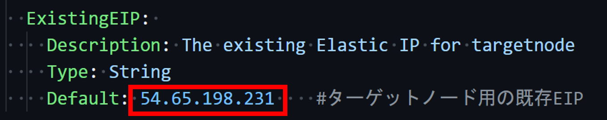

# Lecture13
# CircleCI のサンプルに ServerSpec や Ansible の処理を追加してください。  
目指す構成  
  
1.コントロールノードの設定  
UbuntuへのAnsibleのインストール
```bash
sudo apt update
sudo apt install software-properties-common
sudo apt-add-repository --yes --update ppa:ansible/ansible
sudo apt install ansible
```
roleの作成  
```sudo ansible-galaxy init myrole```  
  
CircleCI CLIのインストール  
```sudo sh -c "curl -fLSs https://circle.ci/cli | bash"```

