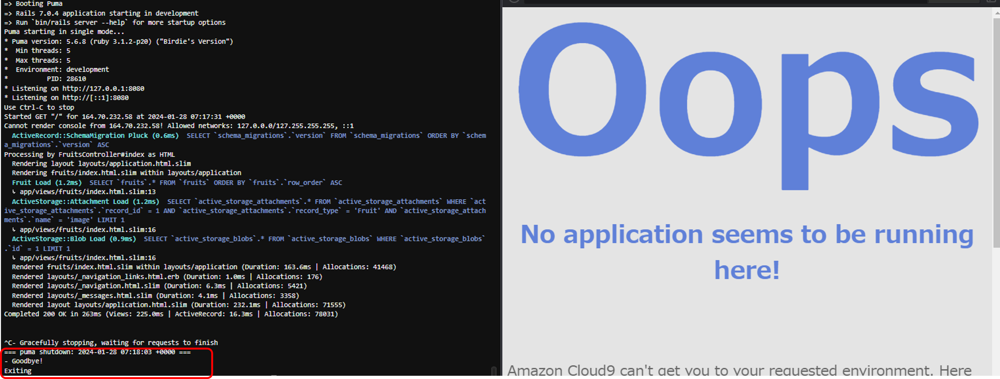

# Lecture03から学んだこと、感じたこと
## 手順まとめ
- サンプルアプリケーションを**GitHub**からclone
- サンプルアプリケーション内のREADME.mdを読み、ruby、Bundler、Rails、Node、yarn の指定のversionをinstallし、useでversion指定
- mysqlのセットアップ（容量の確保・MariaDBを削除後install、パスワード変更・socketファイルの場所　→database.ymlへの書き込み）
- サンプルアプリケーションの起動、ブラウザで確認

## 学んだこと、感じたこと
講義動画を見てハンズオンしたときは何をしているのか全くわからず、その後、用語とコマンドの意味をひとつずつ調べていき再度動画を見ながら手順を整理していくことで
ようやく見えてきました。**GitHub**で提供されているアプリケーションを使用するにも、READMEを確認し、都度自分の環境を整える必要があるということが分かりました。
その環境構築の際に設定ファイルを編集するというのは、どのような処理がなされてアプリケーションが動いているのかという知識がある程度ないとできないことだと思いました。
講義スライドにもありましたが、各分野のプロがいるとしても仕組みだけは理解していかなければと思いました。

### APサーバーについて
- APサーバーの名前とバージョン

- deveropment.rb 編集前のエラー

- APサーバー終了後
`Ctrl+C` pumaを停止後のPreview

- APサーバー起動
`$ rails s` pumaを起動 ブラウザで表示成功

### DBサーバーについて
- DBサーバーの名前とバージョン

- DBサーバー停止後
`exit`で出てから、`$sudo systemctl stop mysqld` でmysqlを停止後のPreview

### Rails の構成管理ツールの名前
 
