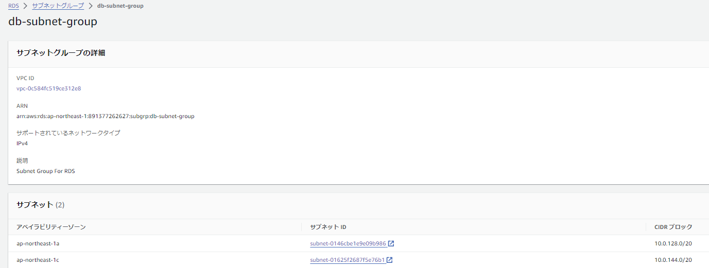
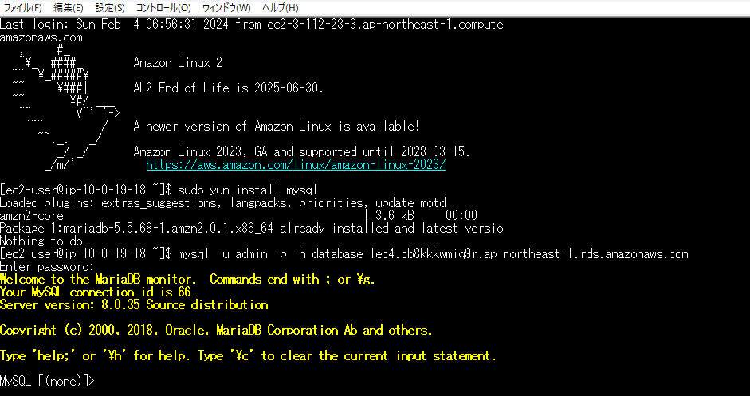

# Lecture04
VPC・サブネット構築→EC2構築、セキュリティグループ作成→RDS構築→EC2からRDSへ接続
## VPC新規作成

## EC2構築

## RDS構築

- サブネットIDは2つともPrivate（ローカル）接続としている

## EC2からRDSへ接続　※Tera Term(SSHクライアント)使用

## 感想
VPCやサブネットグループ、セキュリティグループ等を後から変更するというのは難しく、また、削除するにも他と紐づいているため削除できなかったりとかなり苦戦しました。
VPCの中にEC2があり、そこからRDSへ接続するというイメージが少しできるようになり、最初の構築の時点から間違っていたことが分かりました。
完成のイメージを持って足りないパーツを合わせていくような感じで、非常に難しかったですが、やっと接続できた時は感動しました。

## 用語
- EC2(Elastic Computer Cloud):仮想サーバー
- Subnet:VPC内をさらに分ける
- セキュリティグループ:ファイアウォールのように、どのトラフィックを許可するかなどを制御するためのもの
※補足  
セキュリティグループは定義した通信のみを許可する「ホワイトリスト形式」。　　  
セキュリティグループは「インスタンス単位で設定するファイアウォール機能」で、主にVPCリソースのトラフィックを制御するのに使われる。  

- ネットワークACL(Access Control List):  
(ネットワークACLはサブネット新規作成時にデフォルトで1つ用意される)  
サブネット単位で設定するファイアウォール機能で、主にサブネット間の制御に使われる。  
`ネットワークアクセスコントロールリスト (ACL) は、サブネットレベルで特定のインバウンドまたはアウトバウンドのトラフィックを許可または拒否します。`

- RDS(Relational Database Service):データの保存や処理を行うサービス。  
RDSはセキュリティグループとサブネットグループを使ってどこで実行されるかとセキュリティの設定の管理をする。
- SSH（Secure Shell）:暗号化された通信を提供する。公開鍵と秘密鍵のペアを生成し、公開鍵をリモートサーバーに登録することで、パスワードなしでのセキュアなアクセスが可能となる。