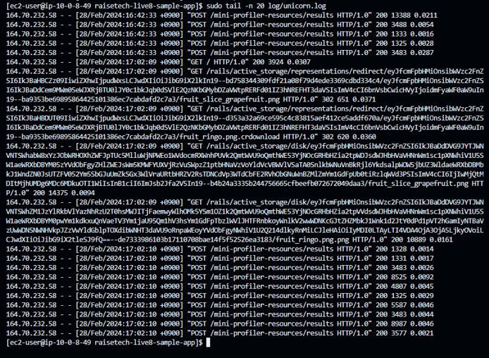

# Lecture05
## EC2 上にサンプルアプリケーションをデプロイして、動作確認  　
- インストールしたもの  
ruby 3.1.2  
Bundler 2.3.14  
Rails 7.0.4  
Node 17.9.1  
yarn 1.22.19  
mysql-devel（Rubyのmysql2 gemなどでMySQLと連携するプログラムをビルドする場合に必要）  
`sudo yum install mysql-devel`  
mysql-community-client（MySQLデータベースにアクセスするアプリケーションやツールの実行に必要）  
`sudo yum install mysql-community-client`  
GraphicsMagick（画像が表示できなかったため）   
`sudo amazon-linux-extras install GraphicsMagick1.3`  
その他ビルドに必要なパッケージ等
- config/database.yml 接続先を変更する

### 組み込みサーバーでの動作確認

### サーバーアプリケーションを分けて動作確認  
- unicorn（APサーバー）単体で起動    
起動：`bundle exec unicorn -c config/unicorn.rb -D`  
状態確認：`ps aux | grep unicorn`  
停止：`kill -QUIT <unicorn_master_pid>`    
curlを使用しての動作確認：`curl --unix-socket <socketのパス> <URL>`

- nginx（WEBサーバー）の起動  
インストール：`sudo amazon-linux-extras install nginx1`  
起動：`sudo systemctl start nginx`  
状態確認：`sudo systemctl status nginx`  
再読み込み：`sudo systemctl reload nginx.service`   
停止：`sudo systemctl stop nginx`  

### nginx＋unicornを連携して動作確認　appleを追加

`sudo tail -n 30 log/unicorn.log`  

`sudo tail -n 10 /var/log/nginx/error.log`  
  
nginxとunicornの設定  

