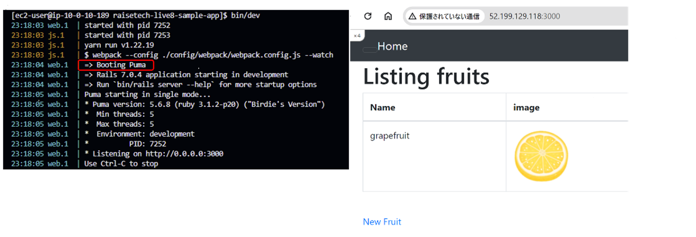
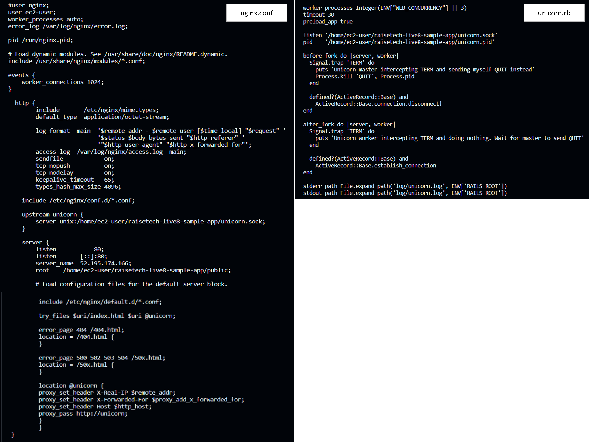
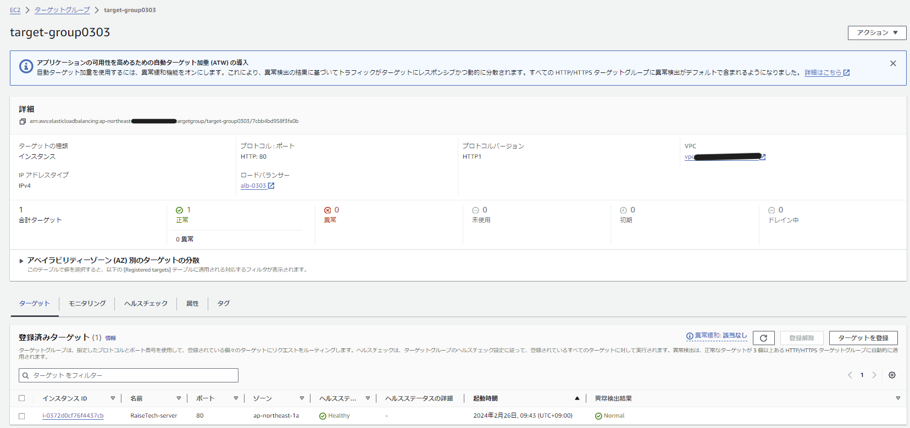

# Lecture05
1. EC2上にサンプルアプリケーションのデプロイ
2. ELB経由でEC2へ接続（冗長化・負荷分散）
3. アプリケーションのデータ保存先をS3に変更
4. インフラ構成図を書く
## 1. EC2 上にサンプルアプリケーションをデプロイして、動作確認  　
- インストールしたもの  
ruby 3.1.2  
Bundler 2.3.14  
Rails 7.0.4  
Node 17.9.1  
yarn 1.22.19  
mysql-devel（Rubyのmysql2 gemなどでMySQLと連携するプログラムをビルドする場合に必要）  
```sudo yum install mysql-devel```   
mysql-community-client（MySQLデータベースにアクセスするアプリケーションやツールの実行に必要）  
```sudo yum install -y https://dev.mysql.com/get/mysql80-community-release-el7-3.noarch.rpm```  
```sudo yum install mysql-community-client```  
GraphicsMagick（画像の表示用）   
```sudo amazon-linux-extras install GraphicsMagick1.3```  
その他ビルドに必要なパッケージ等  
```sudo yum install -y gcc-c++ glibc-headers openssl-devel readline libyaml-devel readline-devel zlib zlib-devel libffi-devel libxml2 libxslt libxml2-devel libxslt-devel sqlite-devel```
- config/database.yml 接続先を変更する

- mysqlクライアントを使用して、RDS（database01）に接続確認  
```mysql -h <RDSのエンドポイント> -u admin -p```

### 組み込みサーバーでの動作確認　grapefruitを追加


### サーバーアプリケーションを分けて動作確認  
- unicorn（APサーバー）単体で起動    
起動：```bundle exec unicorn -c config/unicorn.rb -D```  
状態確認：```ps aux | grep unicorn```  
停止：```kill -QUIT <unicorn_master_pid>```    
curlを使用しての動作確認：```curl --unix-socket <socketのパス> <URL>```


- nginx（WEBサーバー）の起動  
インストール：```sudo amazon-linux-extras install nginx1```  
起動：```sudo systemctl start nginx```  
状態確認：```sudo systemctl status nginx```  
再読み込み：```sudo systemctl reload nginx.service```   
停止：```sudo systemctl stop nginx```  


### nginx＋unicornを連携して動作確認　appleを追加

- unicornのログを20行表示　```sudo tail -n 20 log/unicorn.log```  

- nginxのエラーログを10行表示　```sudo tail -n 10 /var/log/nginx/error.log```  
  
- nginxとunicornの設定  

## 2. ELB 経由で EC2 へ接続
- ELB(ALB)の作成  
  
- target groupの設定

- ELB→EC2→サンプルアプリケーションにmomoを追加  
  
## 3. アプリケーションのデータ保存先を S3 に変更
- S3作成
- AWS CLI をインストール  
```curl "https://awscli.amazonaws.com/awscli-exe-linux-x86_64.zip" -o "awscliv2.zip"```  
```unzip -o awscliv2.zip```  
```sudo ./aws/install```  
- 【S3→EC2に反映】S3へ手動でメロンの画像（fruit_melon_hitokuchi_green.png）をアップロードしてみる。→EC2からs3の配下を確認  
```aws s3 ls raisetech-s3-bucket```


- 【EC2→S3に反映】EC2上のREADME.mdをコピーしてS3にアップロードしてみる。→S3を確認  
```aws s3 cp README.md s3://raisetech-s3-bucket```

- サンプルアプリケーションにao-ringoを追加

- S3に画像が保存されていることを確認（3サイズのデータが保存される。オブジェクト名称変更）


## 4. インフラ構成図

## 感想など
第5回の課題を始めてすぐに、今までの課題でやってきたことの理解が浅いことを痛感しました。特に第3回のrailsアプリケーションの仕組みと設定内容、RDSへの接続等を復習し直しました。環境構築についてもCloud9とは違い、ほぼゼロからの作業で、パッケージから用意したりpathを通したりと非常に作業が多かったです。今回初めて使ったcurlコマンドは、オプションによりURLを指定してファイルをダウンロードしたり、インターネットを介さないsocket通信でアクセスできたりと用途が広いと思いました。
また、nginxとunicornの設定関連が難解で時間がかかりました。エラーが多発し、ログの確認、フォルダ構造の確認、設定ファイルの更新、サーバーの停止、再起動、状態確認等を何度も繰り返したため、コマンド操作に少しは慣れた気がします。
### 調べた用語（ヒントでいただいた用語など）  
- curl：cURL（client for URL）とは、LinuxなどのUNIX系OSでよく利用されるコマンドラインツールの一つで、URLで示されるネットワーク上の場所に対して様々なプロトコル（通信手順）を用いてアクセスできるもの。
- プライべートIPアドレス：会社や家庭などの組織内（ローカル）で一意に割り当てられるアドレス
- パブリックIPアドレス：グローバルIPアドレスともいい、インターネットに接続する際に割り当てられるインターネットの世界で一意のアドレス。  
※プライベートIPアドレスがルーターを通じて変換（NAT(Network Address Translation)）され、パブリックIPアドレスに変換されることで、複数のデバイスがプライベートネットワーク内で通信でき、単一のパブリックIPアドレスを使用して外部のインターネットと通信できるようになる。
- unix socket：単一マシン上の高効率なプロセス間通信に用いられる機能・インタフェースの一種。IPアドレスやポート番号を指定する必要がない。Unixドメインソケットは、ネットワークを経由せずに同一のマシン上のプロセス間通信を行うため、高速でセキュアなプロセス間通信が可能。NginxやUnicornなどのWebサーバーがUnixドメインソケットを使ってアプリケーションサーバーと通信することがある。
- nginx：静的なコンテンツを高効率に処理できるWEBサーバー。リバースプロキシの機能があり、負荷分散できる。
- unicorn：RubyのWebアプリケーションサーバーの一つで、RailsなどのRuby on Railsアプリケーションを実行。動的なコンテンツを処理できる。設定ファイル config/unicorn.rb  
※unicornは数個のworkerプロセスしか持たないのに対し、Nginxは数千のコネクション数を処理できる。したがって、Nginxは大量のアクセスを処理するのに適しており、Unicornはアプリケーションの処理に特化している。