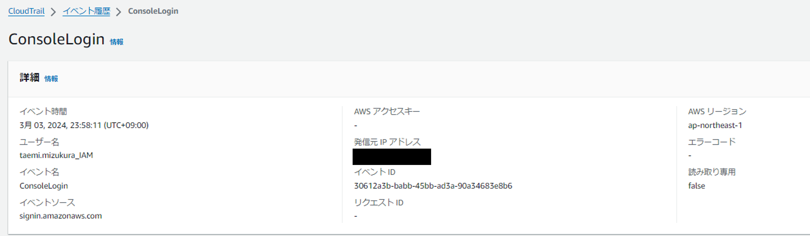
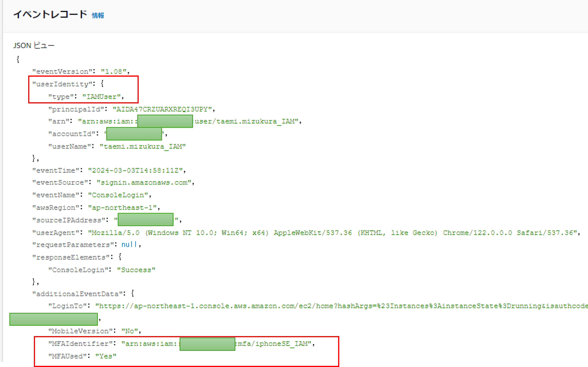
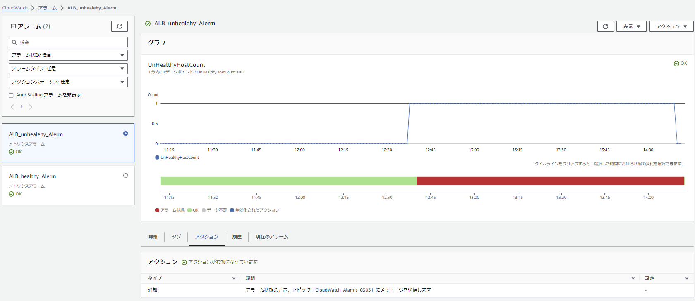
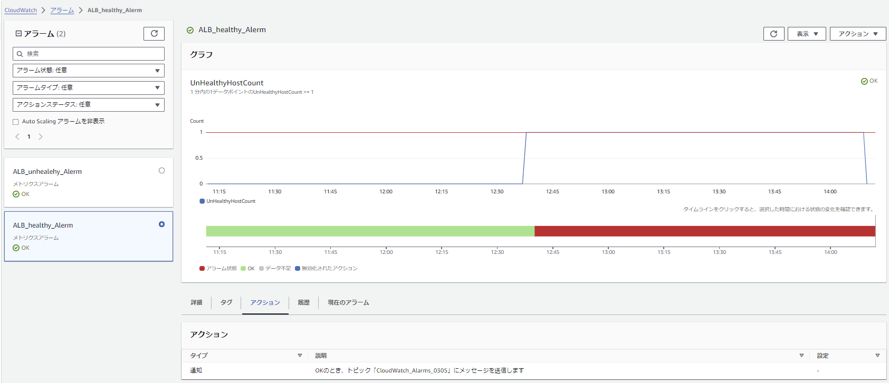
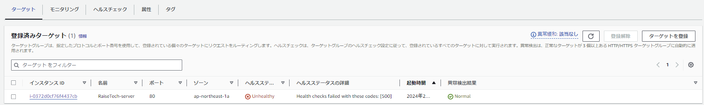
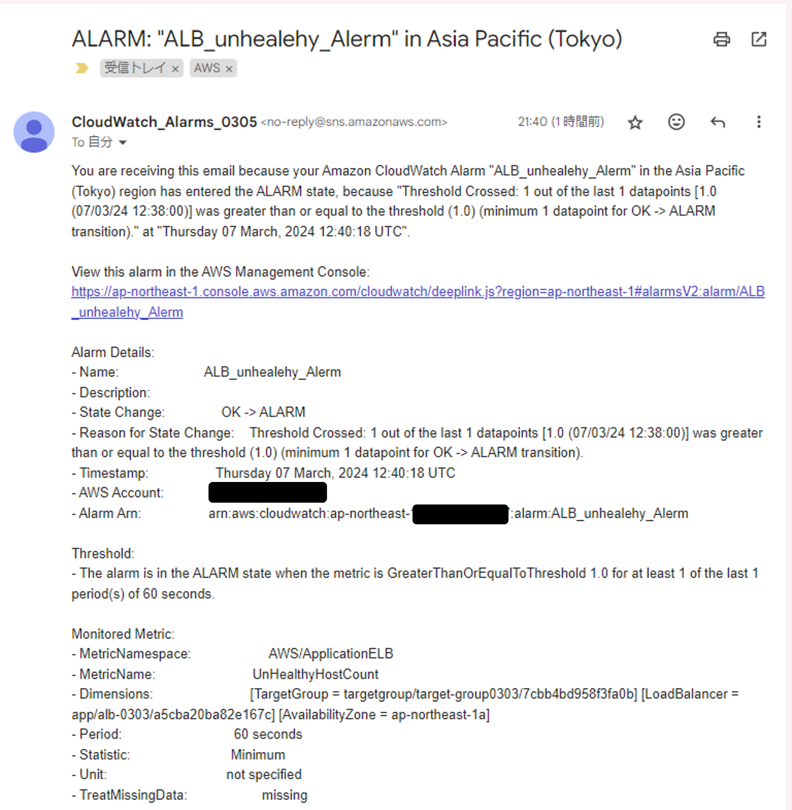
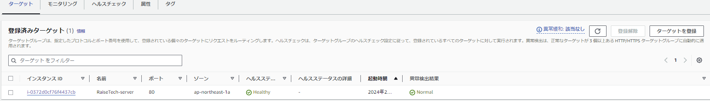
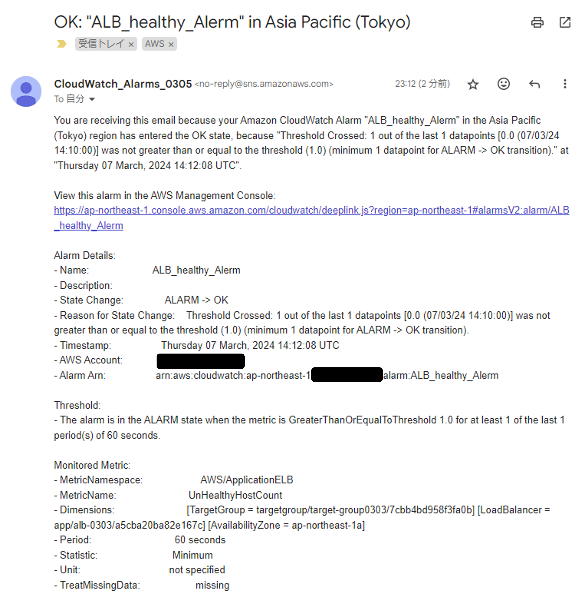
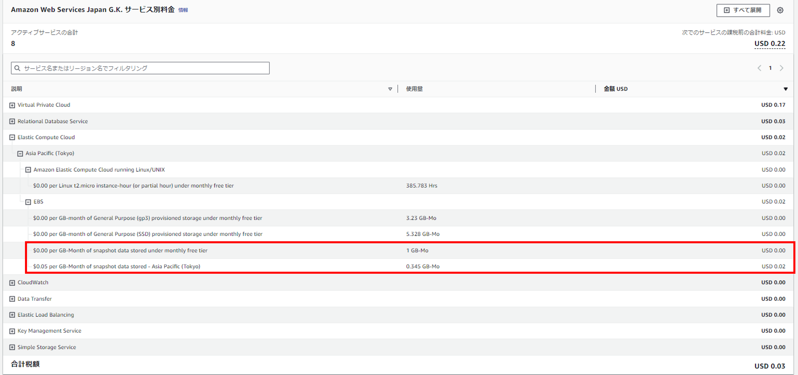

# Lecture06
1. CloudTrailのイベント名と情報
2. CloudWatchアラームを使用したメール通知
3. AWS利用料の見積作成
4. 先月の利用料の確認
5. 感想
## 1. ClaudTrailのイベント記録  
### イベント名：ConsoleLogin

### イベント記録

- userIdentity：ユーザーIDの種類	※ルートユーザーでのログインだと"type": "Root",となる  
- MFAIdentifier：Multi-Factor Authentication (多要素認証)　でログインしたデバイスの情報  
- MFAUsed：ログインにMulti-Factor Authentication (多要素認証)　を設定しているかどうか   
以上のことから、MFAを設定しているIAMユーザがログインに成功したことがわかる  	
## 2. CloudWatchアラームを使用したメール通知
- UnHealthyHostCountがアラーム状態のときの設定		

- UnHealthyHostCountがOK状態のときの設定

- RDSを一時的に停止してみる → Unhealthyとなる

- ALERMメールが届く

- RDSを再起動する　→　Heathyとなる

- OKメールが届く

## 3. AWS利用料の見積作成
[AWS利用料の見積](https://calculator.aws/#/estimate?id=bc224f56db62face54eb1f0c2f79b845c5a51a8b)

## 4. 先月の利用料の確認

EC2にアタッチしている、EBSのsnapshotで無料利用枠を超えてしまっています。
またVPCとRDSでも超えてしまっています。
クレジットカードの請求予定も確認したところ、3/2 AMAZON WEB SERVICES 40円と載っていました。

## 5. 感想
Unhealthy状態を再現するためRDSを一時的に停止するときに、「DBインスタンスをスナップショットに保存する」というチェックボックスが出てきました。先月はここにチェックを入れてしまったのかもしれないと思いました。また2月は第5回の課題にかかりきりで、設定ファイルを更新するのが煩わしく、EC2を起動したままにしてしまいました。無料枠のサービスのおかげで少ない金額で収まり助かりましたが、意外なところで料金が発生していることもあり、理解を深めて正確な予算見積もりができるようにしていきたいです。