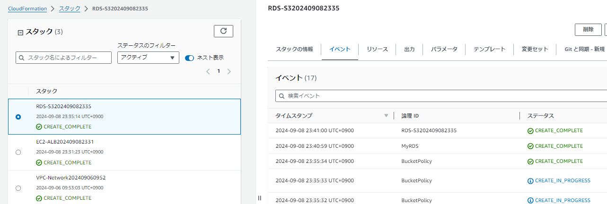
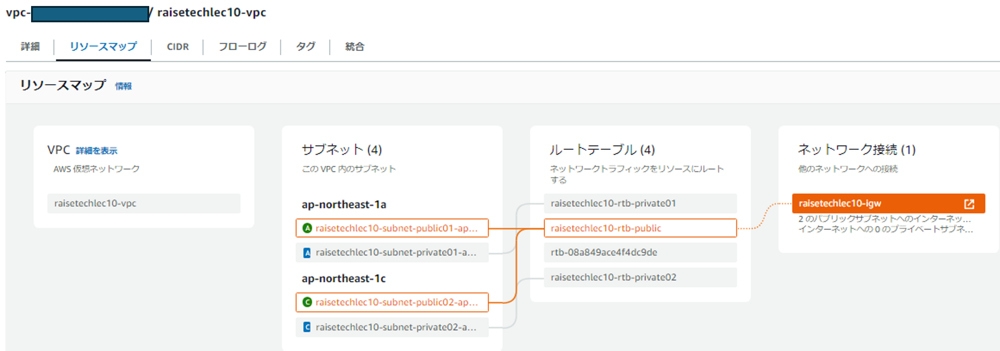
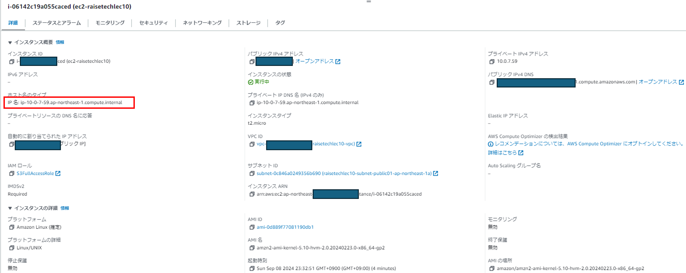
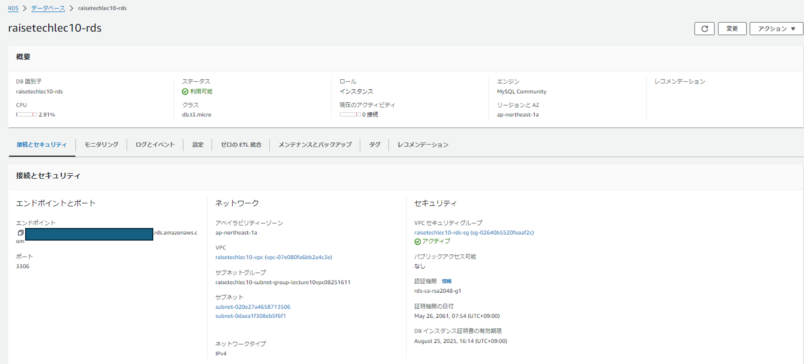
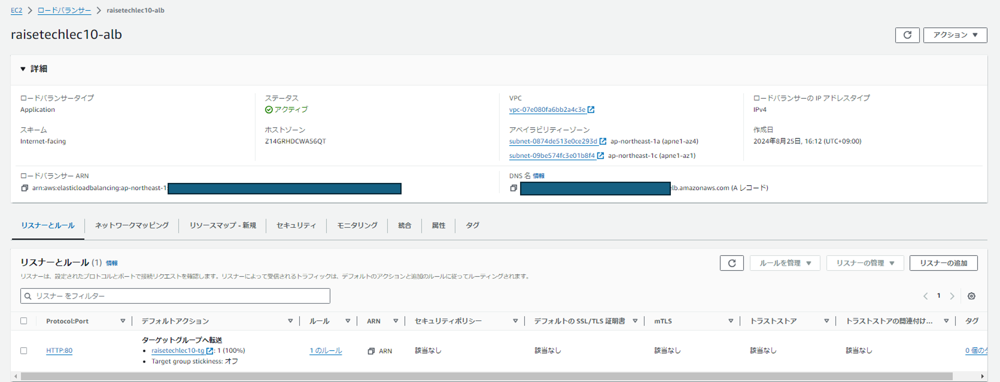
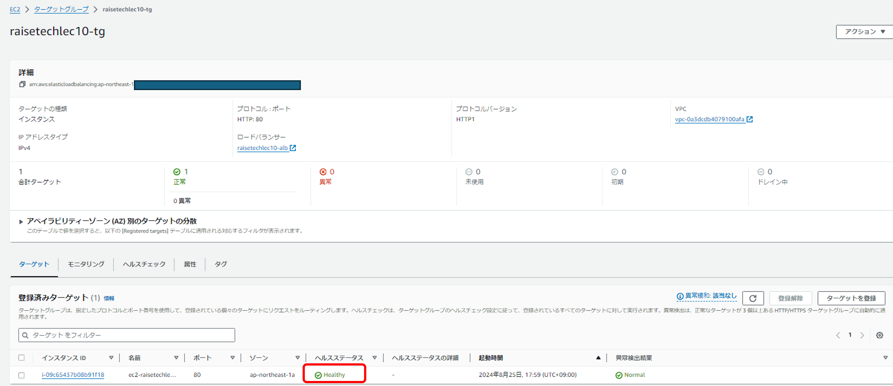
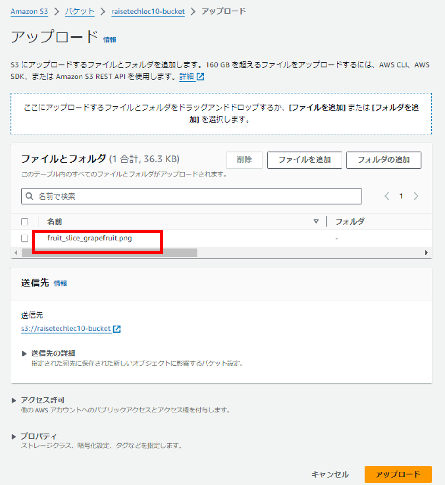
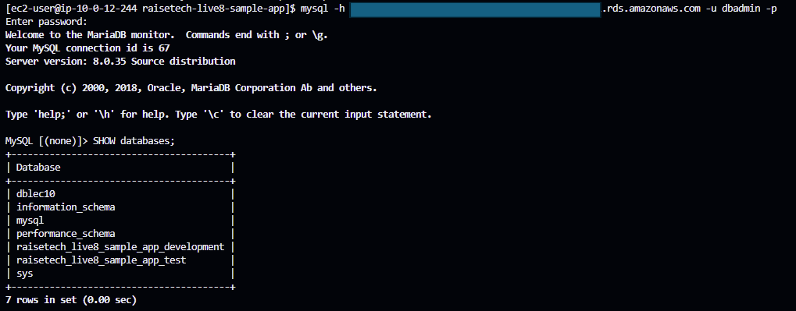
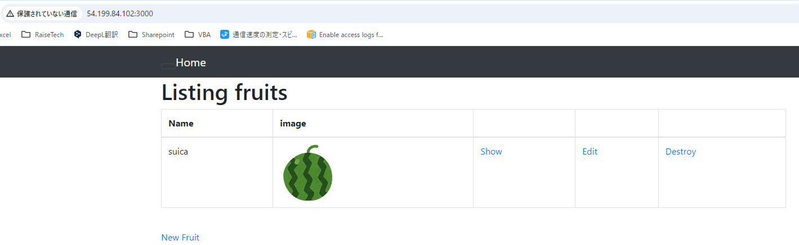
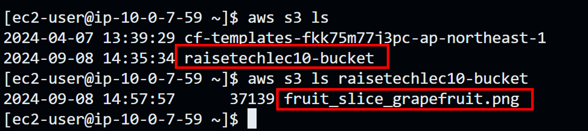

# Lecture10
## CloudFormationを利用して、現在までに作った環境をコード化する

### コード化したyml形式のスタックファイル
- [1_VPC_Network.yml](/1_VPC_Network.yml)  
- [2_EC2_ALB.yml](/2_EC2_ALB.yml)  
- [3_RDS_S3.yml](/3_RDS_S3.yml)  　　

### CloudFormationスタックのデプロイ結果


### VPC


### EC2


### EC2にSSH接続


### ELB


### ターゲットグループ


### RDS


### S3Bucketにコンソールから画像ファイルをアップロードする


### S3Bucket


### オブジェクトURLの確認


### AWS CLI でS3Bucketと画像ファイルの確認
- EC2にAWS CLI をインストール
```bash
curl "https://awscli.amazonaws.com/awscli-exe-linux-x86_64.zip" -o "awscliv2.zip" 
unzip -o awscliv2.zip
sudo ./aws/install
```
- EC2からAWS CLIを使って、コンソールからアップロードしたファイルがS3Bucket内に正しく保存されているかを確認↓


### 感想・学んだこと
前回までのマネジメントコンソールでの操作ではクリックだけでできていた部分が多くあり、一つ一つ読み解いてコード化するのに非常に時間がかかりましたが、少し理解が深まったと思います。
単体のリソースを作成することはできても、その後の紐づけ部分や作成する順序等が難しかったです。
CloudFormationは、スタックを作成すれば、素早く同じ環境が作成できる点、Parametersを使用することでユーザーによるカスタマイズが可能な点、不要時は一気に環境を削除することができる点が特に便利だと思いました。

- `Parameters`  
スタック実行時に都度ユーザーが入力できる。KeyPairやパスワードなどの秘匿情報やカスタマイズしたい値に使用する
- `UserData`  
EC2インスタンス起動時に１度だけ実施してほしいコマンドを記載する
- `組み込み関数`  
テンプレート内で論理IDを呼び出すことにより、作成された時点の論理IDを他のリソースに関連付けすることができる。（`Sub` `Ref` `GetAtt` etc）
- `Outputs`  
他のスタックから呼び出すための機能。スタックで定義した出力値を他のスタックで参照できるようにする。
- `ImportValue`  
他のスタックの`Outputs`で書き出した値をインポートして使用する機能。これにより、異なるスタック間で値を共有することができる。