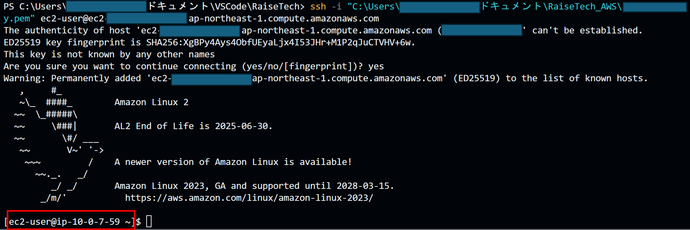
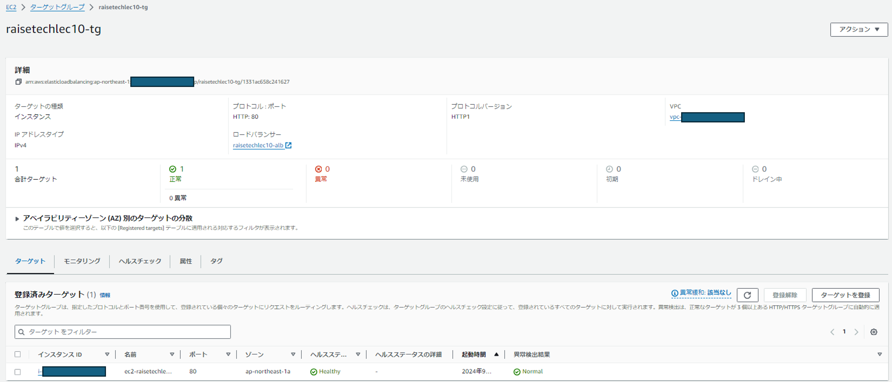

# Lecture10
## CloudFormationを利用して、現在までに作った環境をコード化する

### コード化したyml形式のスタックファイル
[lecture10.yml](/lecture10.yml)

### スタック実行結果

#### VPC

#### EC2

#### RDS

#### ELB

#### ターゲットグループ

#### S3

#### EC2へ接続確認

#### RDSへ接続確認

#### サンプルアプリの保存先をS3にして、画像をアップロード

#### S3に保存された画像の確認

### 感想・学んだこと
前回までのマネジメントコンソールでの操作ではクリックだけでできていた部分が多くあり、一つ一つ読み解いてコード化することで理解が深まりました。
単体のリソースを作成することはできても、その後の紐づけ部分が難しかったです。
また、第5回で行ったサンプルアプリケーションを動作するための環境づくりを復習を兼ねて実行しましたが、想像以上に忘れている部分が多くこちらも時間がかかりました。
CloudFormationは、スタックを作成すれば、素早く同じ環境が作成できる点、Parametersを使用することでユーザーによるカスタマイズが可能な点、不要時は一気に環境を削除することができる点が特に便利だと思いました。

- Parameters_スタック実行時に都度ユーザーが入力できる。KeyPairやパスワードなどの秘匿情報やカスタマイズしたい値に使用する
- UserData_EC2インスタンス起動時に１度だけ実施してほしいコマンドを記載する
- 組み込み関数_テンプレート内で論理IDを呼び出すことにより、作成された時点の論理IDを他のリソースに関連付けすることができる。（Sub、Ref、GetAtt等）
- Outputs_他のスタックから呼び出すための機能。ImportValueなど（今回は一つのスタックにまとめて記載してしまったため未使用）

