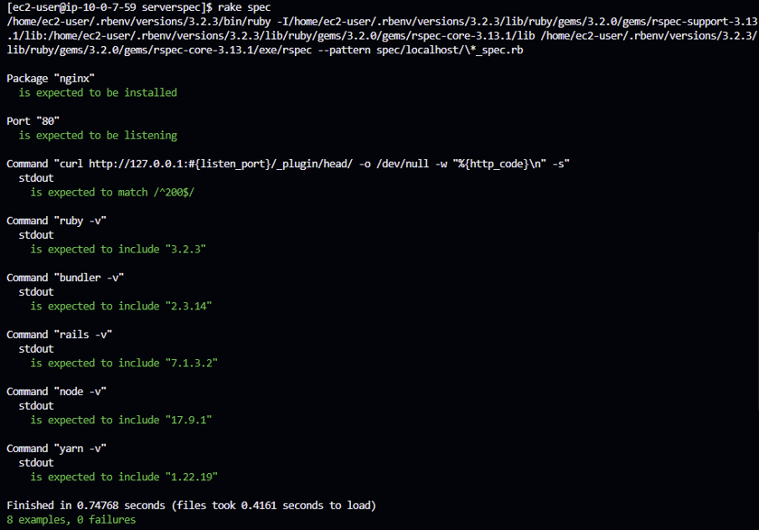

# Lecture11
## ServerSpecのテストが成功すること
### ServerSpecのインストール
ServerSpec公式　https://serverspec.org/  
```
sudo gem install bundler  
sudo gem install serverspec  
mkdir serverspec  
cd serverspec/  
serverspec-init
```


### ディレクトリ構成  


### sample_spec.rb を編集してテスト内容を入力  
`vim spec/localhost/sample_spec.rb`  

require 'spec_helper'

listen_port = 80

#Nginxがインストール済であること  
describe package('nginx') do  
  it { should be_installed }  
  end

#指定のポートがリッスン（通信待ち受け状態）であること  
describe port(listen_port) do  
  it { should be_listening }  
end  

#curlでHTTPアクセスして200 OKが返ってくるか確認する  
describe command('curl http://127.0.0.1:#{listen_port}/_plugin/head/ -o /dev/null -w "%  {http_code}\n" -s') do  
  its(:stdout) { should match /^200$/ }  
end

#gitがインストール済であること  
describe package('git') do  
      it { should be_installed }  
end  

#指定のバージョンがインストールされているか  
describe command('ruby -v') do  
  its(:stdout) { should include '3.2.3' }  
end

describe command('bundler -v') do  
  its(:stdout) { should include '2.3.14' }  
end  
        
describe command('rails -v') do  
  its(:stdout) { should include '7.1.3.2' }  
end  
        
describe command('node -v') do  
  its(:stdout) { should include '17.9.1' }  
end  
        
describe command('yarn -v') do  
  its(:stdout) { should include '1.22.19' }  
end  


### 実行結果


## 感想
- ServerSpecを使ったテストについて  
今回は、サンプルアプリケーションの動作環境が整っているかどうかという観点でテスト内容を考えました。テストは瞬時に終わり、テスト結果で何が不足しているのかが明確にわかるというのがとても便利だと思いました。
- 苦労した点  
サンプルアプリ内にも同名のディレクトリがあるということ、serverspec-initコマンドでディレクトリが自動生成されるということが不明なまま実行してしまい、エラー原因がしばらくわからずテスト環境作りで時間がかかってしまいました。コマンドの意味を調べてから適切なディレクトリで作業するという基本的なことを心掛けたいです。
