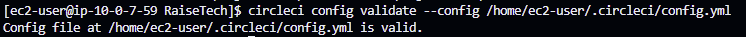
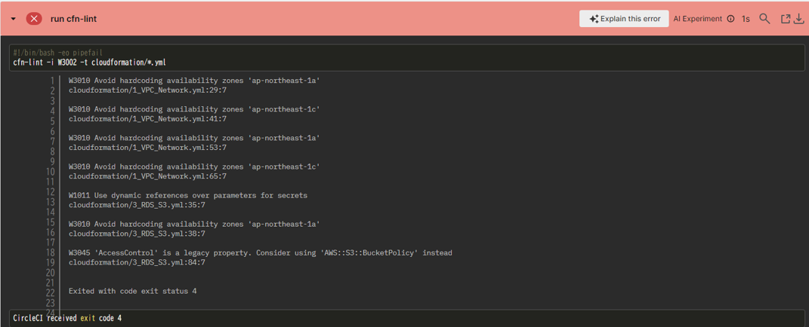

# Lecture12
## CircleCI のサンプルコンフィグが正しく動作するようにリポジトリに組み込む。
### 1. CircleCIのアカウント作成  
GitHubアカウントでの登録と初期設定をする  
[CirclCI公式サイト](https://circleci.com/docs/ja/first-steps)  
→GitHubに、circleci-project-setupブランチと .circleciとフォルダができる。  
参考にしたサイト  
[CircleCI 試してみた](https://qiita.com/sugurutakahashi12345/items/aeca12d9c5a5526c724c)

### 2. EC2からGitHubのリポジトリをcloneする 
cloneする準備  
SSHキーの生成と公開鍵をGitHubに登録する。
```bash
ssh-keygen -t rsa -b 4096 -C "email-address"
```

EC2からGitHubのリポジトリをSSHでcloneする 
```bash
git clone git@github.com:taemimizukura/RaiseTech.git
```
### 3. config.ymlを書き換える
https://github.com/MasatoshiMizumoto/raisetech_documents/tree/main/aws/samples/circleci
```bash
 vim /home/ec2-user/.circleci/config.yml
```
```yml
version: 2.1
orbs:
  python: circleci/python@2.0.3
jobs:
  cfn-lint:
    executor: python/default
    steps:
      - checkout
      - run: pip install cfn-lint
      - run:
          name: run cfn-lint
          command: |
            cfn-lint -i W3002-i -t cloudformation/*.yml

workflows:
  raisetech:
    jobs:
      - cfn-lint
```
### 4. CircleCI CLI を使ったバリデーション
CircleCI CLIのインストール
```bash
curl -fLSs https://raw.githubusercontent.com/CircleCI-Public/circleci-cli/master/install.sh | sudo bash
```
comfig.ymlのバリデーション


### 5. GitHubにpushして、CircleCIを確認
Warnig発生

今回は、警告コード　W1011、W3010、W3045 を検知対象外にすることでWarnigをなくす。
```yml
version: 2.1
orbs:
  python: circleci/python@2.0.3
jobs:
  cfn-lint:
    executor: python/default
    steps:
      - checkout
      - run: pip install cfn-lint
      - run:
          name: run cfn-lint
          command: |
            cfn-lint -i W3002-i W1011 -i W3010 -i W3045 -t cloudformation/*.yml

workflows:
  raisetech:
    jobs:
      - cfn-lint
```
警告コード  
W3002	プロパティがパッケージコマンドでのみ動作するように設定されている場合に警告する  
W1011	シークレットのパラメータをREFする代わりに、動的参照を使用する  
W3010	可用性ゾーンのプロパティはハードコードすべきではない  
W3045	S3バケットへのアクセス制御はバケットポリシーで行う必要があります  

## 感想 
いつもはローカル環境からpushしていますが、CircleCI CLIでバリデーションを行うため、EC2にリポジトリをcloneして、config.ymlの編集、pushを行ったところかなり難しく感じました。  
また、Cloudformationの記述などでWarningが出てしまったため、今回は無視するコードに追加することで警告を回避しましたが、VSCODEにCloudFormation Linterという拡張機能を入れるとその場で記述に関する警告が出て修正しやすいということで入れてみました。  
[Windows環境のVSCodeでcfn-lintを使えるようにする手順。](https://qiita.com/kmmz/items/415af7c9270302d600f5)  
## メモ
- 隠しフォルダは、名前の先頭にドット（.）が付いている。  通常のlsコマンドでは表示されないため、```ls -la```を使うと表示される。
- リポジトリにpushする前に、設定ファイル(comfig.yml)の内容が正しいかどうかをローカルでバリデーションすると効率的。
- バリデーション　構文エラーや有効性などを確認すること
 


