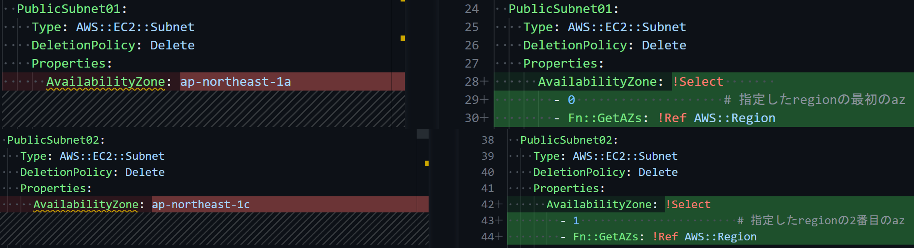
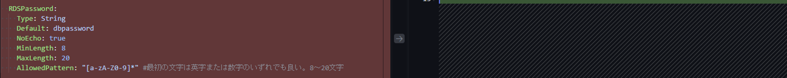
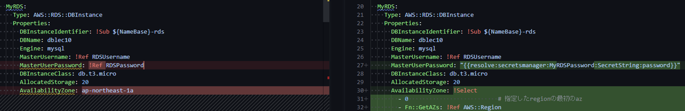
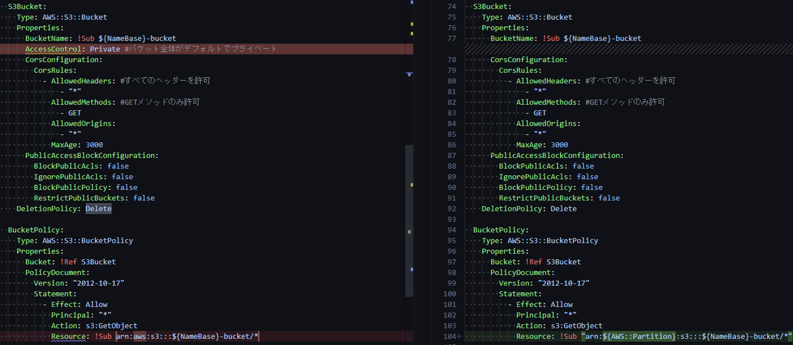
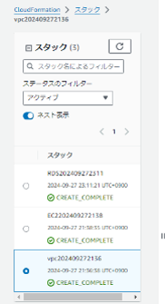
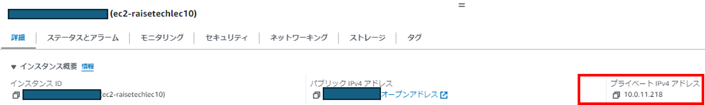
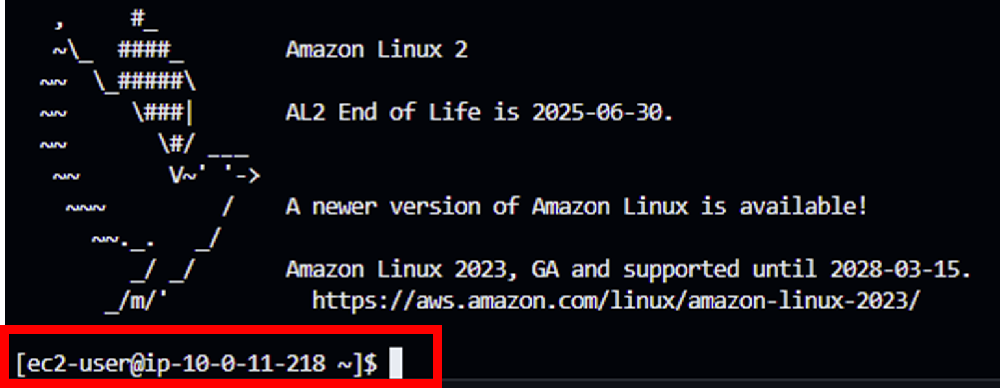
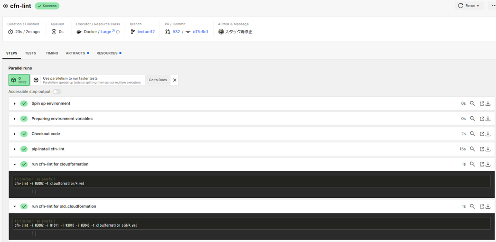

# Lecture12 追加修正分提出
circleCIで警告が出ていたCloudformationのスタックの構文を修正し、再度CircleCIを実行しました。 
## 修正した警告箇所  
1. W3010 AvailabilityZoneのハードコーディングを避ける  
Fn::GetAZs＝指定したリージョンのAvailabilityZoneをすべて返す  
東京リージョンの場合 ["ap-northeast-1a", "ap-northeast-1c", "ap-northeast-1d"] が返される  
Select関数でインデックス指定する  
0＝"ap-northeast-1a"  
1＝"ap-northeast-1c"  
2＝"ap-northeast-1d"  


2. W1011 シークレットのパラメータに動的参照を使う  
secretsmanagerを使用してRDSのパスワードを保存したので、Parametersからは削除 
 
secretsmanagerからパスワードを呼び出す  


3. W3045 'AccessControl' はレガシープロパティです。代わりに'AWS::S3::BucketPolicy'の使用を検討してください。
AccessControlは古いので使わない  
バケットポリシーでパブリックアクセスを許可しているので不要（バケットポリシーのほうが優先される
）  


4. VSCodeの拡張機能で警告が出たため、修正　↑　  
現在のAWSアカウントに応じたパーティションを自動的に取得する。
- aws：最も一般的なパーティション。北米、南米、ヨーロッパ、アジアなど、多くのリージョンがこのパーティションに属します。
- aws-cn：中国（北京、寧夏）で運営されるAWSサービス用のパーティションです。中国本土では特別な法律や規制があるため、専用のインフラストラクチャが必要です。
- aws-us-gov：米国政府向けに設計されたパーティションで、政府関連のサービスやデータに特化しています。セキュリティやコンプライアンスが強化されています。

## 修正したCloudfornationスタックをインポート

## EC2に接続確認
作成されたEC2  

EC2へ接続  


## circleCIでチェック
.circleci/config.yml を以下のように書き換え
```yml
version: 2.1
orbs:
  python: circleci/python@2.0.3

jobs:
  cfn-lint:
    executor: python/default
    steps:
      - checkout
      - run: pip install cfn-lint

      # cloudformation フォルダのチェック
      - run:
          name: run cfn-lint for cloudformation
          command: |
            cfn-lint -i W3002 -t cloudformation/*.yml

      # cloudformation_old フォルダのチェック
      - run:
          name: run cfn-lint for old_cloudformation
          command: |
            cfn-lint -i W3002 -i W1011 -i W3010 -i W3045 -t cloudformation_old/*.yml

workflows:
  raisetech:
    jobs:
      - cfn-lint
```
## CircleCI実行結果


## 感想
構文に関する警告が出ないようにするymlの書き方や、circleCIはフォルダごとにチェック内容を変えられることや、VSCodeのCloudformation Linterの構文チェックのほうが厳しいなど色々な気づきがありました。


