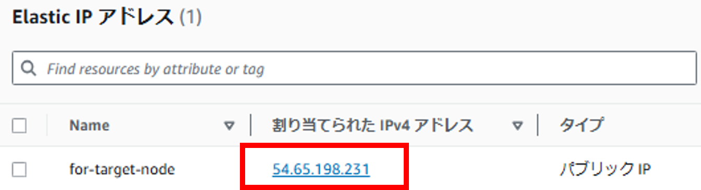

# Lecture13
# CircleCI のサンプルに ServerSpec や Ansible の処理を追加してください。  
目指す構成  
  
1.コントロールノードの設定  
UbuntuへのAnsibleのインストール
```bash
sudo apt update
sudo apt install software-properties-common
sudo apt-add-repository --yes --update ppa:ansible/ansible
sudo apt install ansible
```
roleの作成  
```sudo ansible-galaxy init myrole```  
  
CircleCI CLIのインストール  
```sudo sh -c "curl -fLSs https://circle.ci/cli | bash"```


Amazon Linux 2 は、デフォルトで Python 2.7 を使用しており、これは Ansible 2.10 以降でサポートされなくなっています。Ansible 2.10以降では Python 3 が必須となり、Python 2 を使用しているターゲットシステムはサポートされなくなっています。Amazon Linux 2 のように Python 2 を使うシステムを管理する場合、Ansible の互換性のあるバージョンに ダウングレード する必要があります。以下のバージョンが適していまAnsible 2.9 は Python 2 をサポートしており、Amazon Linux 2 で使用可能です。
コントロールノード： Python 3を使用してAnsibleを実行して問題ありません。Ansibleの最新バージョンもPython 3上で動作します。

ターゲットノード（Amazon Linux 2）： もしターゲットノードにPython 2しかない場合は、Ansible 2.9以前のバージョンを使用することをお勧めします。Ansible 2.10以降では、Python 2を使うシステムとの互換性が制限されています。

推奨する設定
コントロールノード: Python 3 + Ansible 2.9.x（もしくは互換性のあるバージョン）
ターゲットノード（Amazon Linux 2）: Python 2でも動作するAnsibleバージョン（Ansible 2.9.xなど）