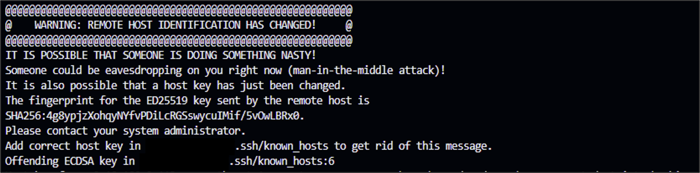

# Lecture13
【課題】CircleCI のサンプルに Serverspec や Ansible の処理を追加してください。  
## 以下の①～④の工程をCircleCIで自動化しました。  
実行用リポジトリ　　[circleci_lecture13](https://github.com/taemimizukura/circleci_lecture13)  
① CloudFormationの構文チェック  
② CloudFormationスタック実行（EC2、ALB、RDS、S3追加）  
③ AnsibleでターゲットノードのEC2にサンプルアプリケーションの動作環境構築   
④ Serverspecでターゲットノードの環境をテストする  
【環境】  
コントロールノードとターゲットノードの両方に、Amazon Linux2をOSとするEC2インスタンスを使用  
【実行方法】  
GitHubにpushすることで、①～④の処理が自動実行される。
## １．自動化準備
### ■ コントロールノードの作成とセットアップ
マネジメントコンソールで事前にElastic IPアドレスを作成（スタック削除後再作成した場合も同じパブリックIPを使用したかったため）  
  
CloudFormationで、VPCとコントロールノード用のEC2を作成（既存のElastic IPをスタック内で関連付ける）  
[1_VPC_Network_ctrl.yml](https://github.com/taemimizukura/circleci_lecture13/blob/lec13/cloudformation/1_VPC_Network_ctrl.yml "共用VPC")  
[2_EC2_ctrl.yml](https://github.com/taemimizukura/circleci_lecture13/blob/lec13/cloudformation/3_EC2_target.yml "コントロールノード用EC2")  

```bash
#必要なパッケージのインストール
sudo yum groupinstall -y "Development Tools" 
sudo yum install -y bzip2 libffi-devel libyaml-devel gdbm-devel ncurses-devel curl unzip

```
ruby インストール  
```bash
# rbenvインストール
git clone https://github.com/rbenv/rbenv.git ~/.rbenv
echo 'export PATH="$HOME/.rbenv/bin:$PATH"' >> ~/.bash_profile
echo 'eval "$(rbenv init -)"' >> ~/.bash_profile
source ~/.bash_profile

# ruby-buildインストール
git clone https://github.com/rbenv/ruby-build.git ~/.rbenv/plugins/ruby-build
echo 'export PATH="$HOME/.rbenv/plugins/ruby-build/bin:$PATH"' >> ~/.bash_profile
source ~/.bash_profile

# ruby3.2.3インストール
rbenv install 3.2.3
rbenv global 3.2.3
```
```bash
# Bundler インストール  
gem install bundler -v '2.3.14'
```
```bash
# Ansible インストール  
sudo amazon-linux-extras install ansible2 -y 
sudo yum install -y ansible
``` 
```bash
#CircleCI CLI インストール
curl -fLSs https://raw.githubusercontent.com/CircleCI-Public/circleci-cli/master/install.sh | sudo bash
``` 
その他セットアップ
- CircleCI（SSH KEY登録、環境変数登録、circleci/config.yml作成）
- ansible/inventory  
  ansible/playbook  
  ansible/roles 
  各種作成  

- Serverspec インストール&セットアップ、テストコード作成
#### テストに使ったコマンド 
~/circleci_lecture13/ansible/  
  
```bash
# Dry run
ansible-playbook -i inventory playbook.yml --check
# run
ansible-playbook -i inventory playbook.yml
```
※ -v -vv -vvv オプションで出力が詳細になる  

CircleCI CLIによる構文チェック  
~/circleci_lecture13/  
```bash
circleci config validate
```
## ２．実行結果
Total　29分25秒  
  
cfn-lint---CloudFormationの構文チェック  
  
execute-cloudformation---スタックによるEC2、ALB、RDS、S3の作成  
  
execute-ansible---サンプルアプリ動作環境の構築  
  
execute-serverspec---コントロールノードの環境テスト  
  
serverspecテスト結果  
  
DNS名とヘルスチェックを確認  
  
  
ALBのDNS名でアクセスし、画像をアップロード  
  
S3に画像が保存されているか確認  
  
3つのサイズの画像が保存されていることを確認  
  

## 感想・苦労した点・学んだこと
- Ansible  
ディレクトリ構成に気を付ければplaybookなどがシンプルに書けて見やすい半面、ルールを理解するのにかなり時間を要しました。またターゲットノードでコマンドが空振りになることが多く、remote操作の難しさに当たりました。ログインシェルという概念を初めて知りました。
- CircleCI  
circleciはエラーが出たときに生成AIがエラー原因を説明して解決の手助けをしてくれるのが画期的だと思いました。
- Sereverspec  
第12回と同じテストの書き方ではこちらも空振りになってしまうことが多く何度も修正しました。
- サンプルアプリ  
第5回課題実行時と構成が変わっていたのと、何度やってもpumaとnginxの設定や権限関係などで苦労します。また、数か月経っただけでも、対応するversionが変わっていたりするので、エラーログなどを見ながら都度エラーに対処できるようにしていかなければと思いました。
- Elastic IPの使いまわしで起きたエラーと解決法  
EC2インスタンス再作成後SSH接続すると、警告が出てローカルからもアクセスできなくなってしまう。（同じIPアドレスなのにfingerprintが違うため危険なアクセスとみなされブロックされてしまう。）  
  
known_hostsファイルから指定のホストの公開鍵情報を削除する。  
下記コマンド実行、またはエラー文で指摘されている該当行を手で削除する。
    ```bash
    ssh-keygen -R ec2-54-64-20-148
    ``` 
- ~/.sshにあるファイルについて  
上記エラー出現時、SSH接続の鍵関係について理解が浅かったため調べ直しました。   
**authorized_keys**---接続元の公開鍵の情報が保存されるファイル。EC2作成初期から存在。（最初は〇〇.pemのペアである公開鍵の情報が入っている。）  
**id_rsa**------- 秘密鍵        （`ssh-keygen`で生成されるキーペア）  
**id_rsa.pub**---公開鍵   （`ssh-keygen`で生成されるキーペア）  
**known_hosts**--- 接続先ホストの公開鍵が保存される（初回接続時にファイルが生成される）  
※ fingerperint--- 公開鍵を識別するための短い文字列（初回接続時に表示される）
```ssh-keygen -lf ~/.ssh/id_rsa.pub```で表示することもできる。

### Ansibleディレクトリ構成  
  
