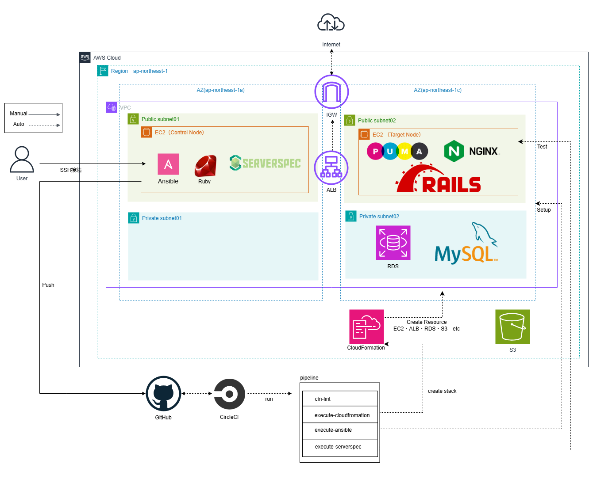

# 第14回　第13回で自動化処理したAWS構成図を作成する
## CicrcleCI自動化処理構成図  
[circleci_lecture13](https://github.com/taemimizukura/circleci_lecture13)　自動化を実行したリポジトリ  
[lecture13.md](https://github.com/taemimizukura/RaiseTech/blob/main/lecture13.md)　作業概要と実行結果のまとめ  

コントロールノード、ターゲットノードともにAmazon Linux2をOSとするEC2インスタンスを使用しています。  
SSH接続したコントロールノードからGitHubへpushすることで、CloudFormationスタックの構文チェック、CloudFormationでのリソース(EC2・ALB・RDS・S3)作成、AnsibleによるEC2へのRailsアプリケーションの動作環境構築、ServerspecによるEC2環境のテストが自動実行されます。

